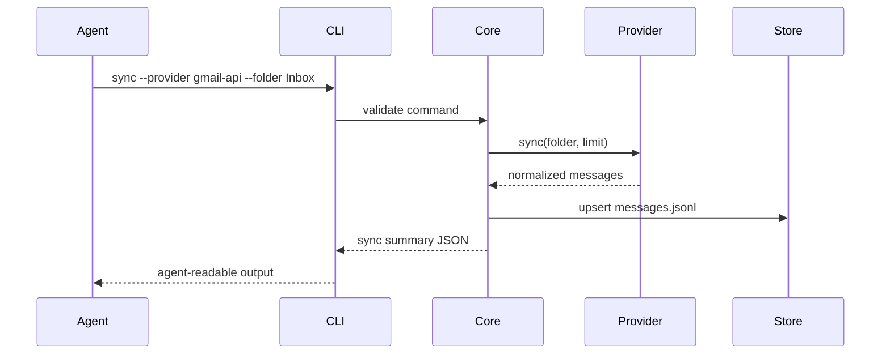
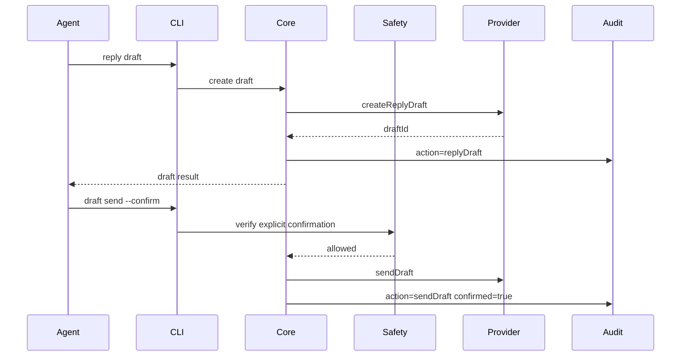
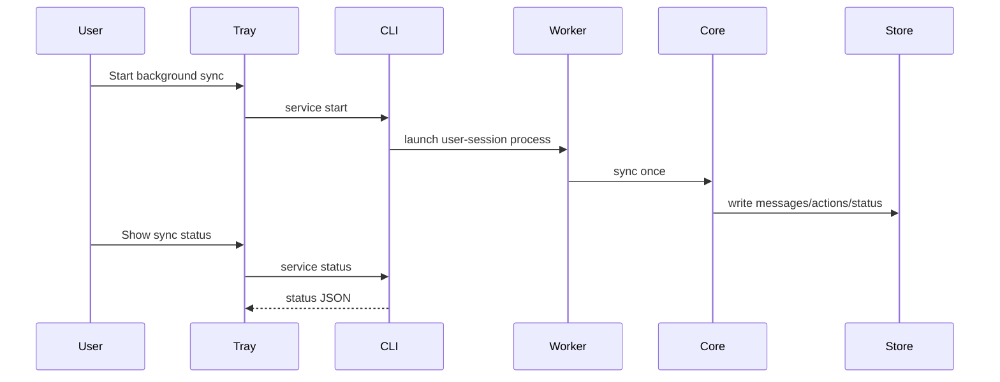

# C4 Dynamic Flows

## Sync Flow

```mermaid
sequenceDiagram
    participant Agent
    participant CLI
    participant Core
    participant Provider
    participant Store

    Agent->>CLI: sync --provider gmail-api --folder Inbox
    CLI->>Core: validate command
    Core->>Provider: sync(folder, limit)
    Provider-->>Core: normalized messages
    Core->>Store: upsert messages.jsonl
    Core-->>CLI: sync summary JSON
    CLI-->>Agent: agent-readable output
```

## Confirmed Send Flow

```mermaid
sequenceDiagram
    participant Agent
    participant CLI
    participant Core
    participant Safety
    participant Provider
    participant Audit

    Agent->>CLI: reply draft
    CLI->>Core: create draft
    Core->>Provider: createReplyDraft
    Provider-->>Core: draftId
    Core->>Audit: action=replyDraft
    Core-->>Agent: draft result
    Agent->>CLI: draft send --confirm
    CLI->>Safety: verify explicit confirmation
    Safety-->>Core: allowed
    Core->>Provider: sendDraft
    Core->>Audit: action=sendDraft confirmed=true
```

## Optional Background Sync Flow

```mermaid
sequenceDiagram
    participant User
    participant Tray
    participant CLI
    participant Worker
    participant Core
    participant Store

    User->>Tray: Start background sync
    Tray->>CLI: service start
    CLI->>Worker: launch user-session process
    Worker->>Core: sync once
    Core->>Store: write messages/actions/status
    User->>Tray: Show sync status
    Tray->>CLI: service status
    CLI-->>Tray: status JSON
```
