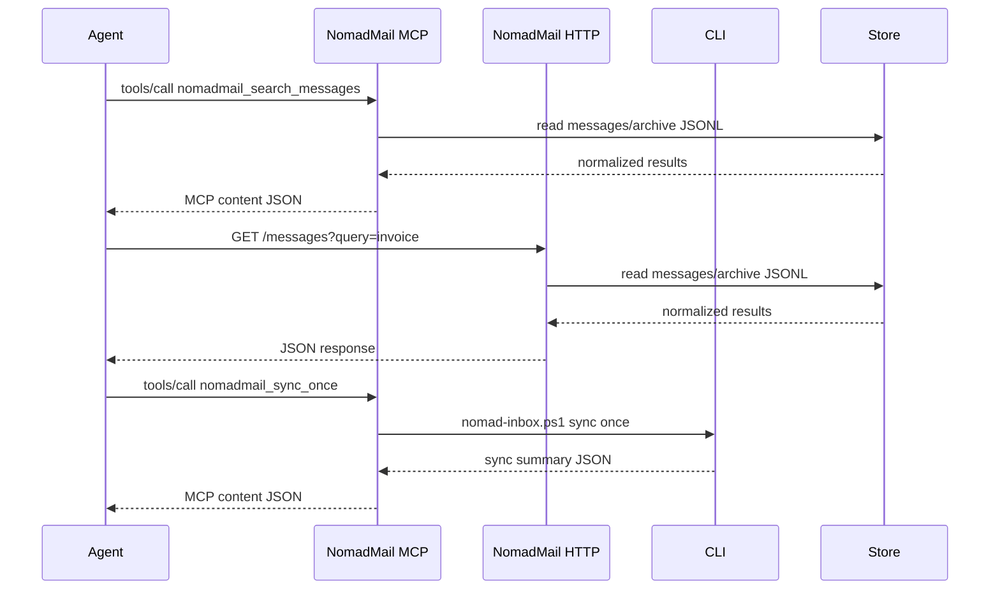
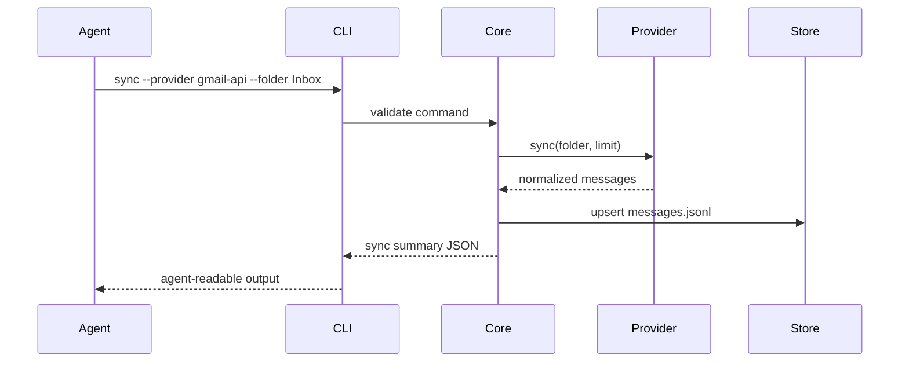
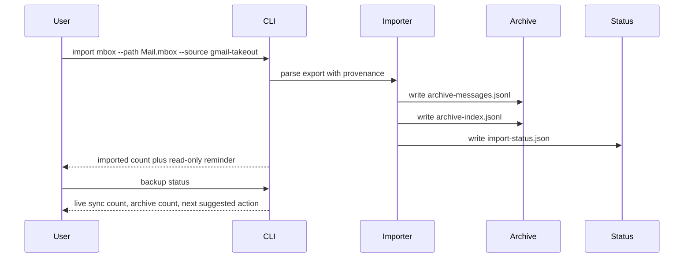
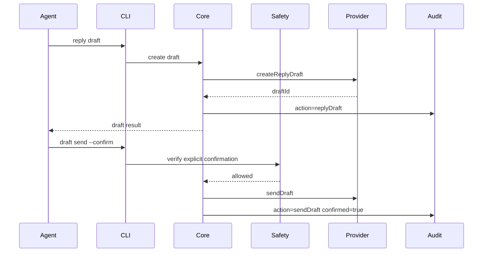
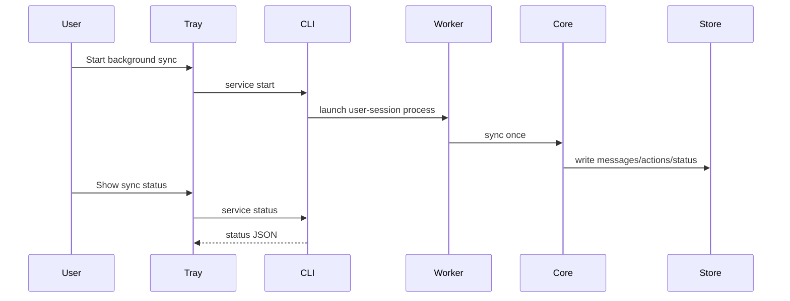

# C4 Dynamic Flows

## Agent Tool Flow

```mermaid
sequenceDiagram
    participant Agent
    participant MCP as NomadMail MCP
    participant HTTP as NomadMail HTTP
    participant CLI
    participant Store

    Agent->>MCP: tools/call nomadmail_search_messages
    MCP->>Store: read messages/archive JSONL
    Store-->>MCP: normalized results
    MCP-->>Agent: MCP content JSON

    Agent->>HTTP: GET /messages?query=invoice
    HTTP->>Store: read messages/archive JSONL
    Store-->>HTTP: normalized results
    HTTP-->>Agent: JSON response

    Agent->>MCP: tools/call nomadmail_sync_once
    MCP->>CLI: nomad-inbox.ps1 sync once
    CLI-->>MCP: sync summary JSON
    MCP-->>Agent: MCP content JSON
```

## Sync Flow

```mermaid
sequenceDiagram
    participant Agent
    participant CLI
    participant Core
    participant Provider
    participant Store

    Agent->>CLI: sync --provider gmail-api --folder Inbox
    CLI->>Core: validate command
    Core->>Provider: sync(folder, limit)
    Provider-->>Core: normalized messages
    Core->>Store: upsert messages.jsonl
    Core-->>CLI: sync summary JSON
    CLI-->>Agent: agent-readable output
```

## Archive Import Flow

```mermaid
sequenceDiagram
    participant User
    participant CLI
    participant Importer
    participant Archive
    participant Status

    User->>CLI: import mbox --path Mail.mbox --source gmail-takeout
    CLI->>Importer: parse export with provenance
    Importer->>Archive: write archive-messages.jsonl
    Importer->>Archive: write archive-index.jsonl
    Importer->>Status: write import-status.json
    CLI-->>User: imported count plus read-only reminder
    User->>CLI: backup status
    CLI-->>User: live sync count, archive count, next suggested action
```

## Confirmed Send Flow

```mermaid
sequenceDiagram
    participant Agent
    participant CLI
    participant Core
    participant Safety
    participant Provider
    participant Audit

    Agent->>CLI: reply draft
    CLI->>Core: create draft
    Core->>Provider: createReplyDraft
    Provider-->>Core: draftId
    Core->>Audit: action=replyDraft
    Core-->>Agent: draft result
    Agent->>CLI: draft send --confirm
    CLI->>Safety: verify explicit confirmation
    Safety-->>Core: allowed
    Core->>Provider: sendDraft
    Core->>Audit: action=sendDraft confirmed=true
```

## Optional Background Sync Flow

```mermaid
sequenceDiagram
    participant User
    participant Tray
    participant CLI
    participant Worker
    participant Core
    participant Store

    User->>Tray: Start background sync
    Tray->>CLI: service start
    CLI->>Worker: launch user-session process
    Worker->>Core: sync once
    Core->>Store: write messages/actions/status
    User->>Tray: Show sync status
    Tray->>CLI: service status
    CLI-->>Tray: status JSON
```
